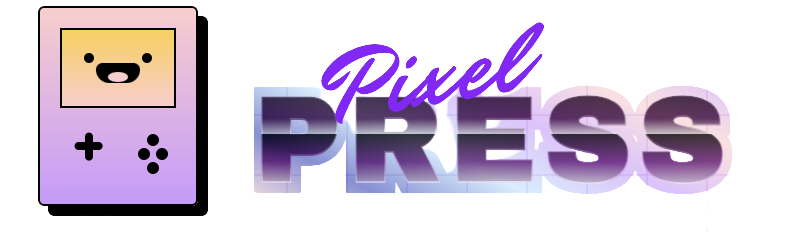
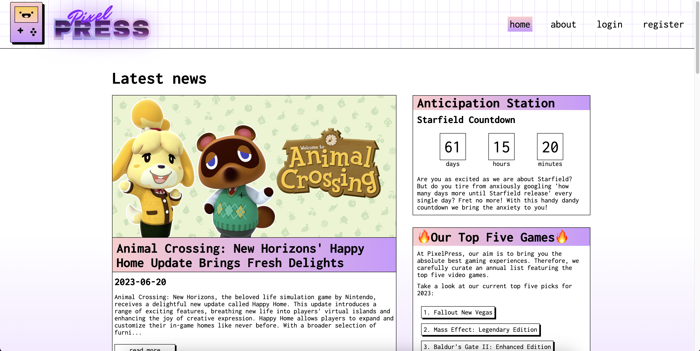

[//]: # (project shields here)

[//]: # (<!-- PROJECT LOGO -->)
<br>
<div align="center">
  <a href="https://github.com/github_username/repo_name">
    
  </a>

<h3 align="center">Pixel Press</h3>
</div>

<!-- TABLE OF CONTENTS -->
<details>
  <summary>Table of Contents</summary>
  <ol>
    <li>
      <a href="#about-the-project">About The Project</a>
      <ul>
        <li><a href="#built-with">Built With</a></li>
      </ul>
    </li>
    <li>
      <a href="#getting-started">Getting Started</a>
      <ul>
        <li><a href="#prerequisites">Prerequisites</a></li>
        <li><a href="#installation">Installation</a></li>
      </ul>
    </li>
    <li><a href="#usage">Usage</a></li>
    <li><a href="#contact">Contact</a></li>
    <li><a href="#acknowledgments">Acknowledgments</a></li>
  </ol>
</details>

<!-- ABOUT THE PROJECT -->
## About The Project



This project was commissioned for NOVI University of Applied Sciences, as a final assignment for the front-end curriculum. The project was created with the help of the RAWG.io API.

<p align="right">(<a href="#readme-top">back to top</a>)</p>

### Built With

* 
* 
* 
* 

<p align="right">(<a href="#readme-top">back to top</a>)</p>

<!-- GETTING STARTED -->
## Getting Started

If you wish to copy the application and run it locally on your machine, follow the steps. If you encounter any issues with installing the application, please notify me by creating a pull request and submitting the issue. 

Are you a first time user? Start with prerequisites.

### Prerequisites

These are the following prerequisites for the application. Check if the following programs are installed on your local machine. If not, follow the instructions given. 

* npm
  ```sh
  npm install npm@latest -g
  ```

* node.js
  ```sh
  download via https://nodejs.org/en
  ```
* API key
  ```sh
  request via https://rawg.io/apidocs
  ```

### Installation

1. Get an API Key at [RAWG.io](https://rawg.io/apidocs)
2. Clone the repo
   ```sh
   $ git clone git@github.com:vleesenbotten/eindopdracht-frontend-fml.git
   ```
3. Install NPM packages
   ```sh
   npm install
   ```
4. Enter the API key on the following pages
   ```js
   Search.js
   GameDetails.js
   ```
5. Run the application
   ```sh
   npm start
   ```
6. If you encounter any errors running the npm script, run the following command
   ```sh
   npm test
   ```
7. Execute tests by choosing
   ```sh
   > Press a to run all tests
   ```
   
<p align="right">(<a href="#readme-top">back to top</a>)</p>

<!-- USAGE EXAMPLES -->
## Usage

This project has been set up as a final assignment. It has no other noteworthy use beyond that.

<p align="right">(<a href="#readme-top">back to top</a>)</p>

<!-- CONTACT -->
## Contact

Tessa Helle - [@vleesenbotten](https://github.com/vleesenbotten)

NOVI hogeschool - [@NOVI](https://www.novi.nl)

<p align="right">(<a href="#readme-top">back to top</a>)</p>

<!-- ACKNOWLEDGMENTS -->
## Acknowledgments

* Many special thanks to Nova, Elwyn and Sam for getting me through the final steps :)

<p align="right">(<a href="#readme-top">back to top</a>)</p>